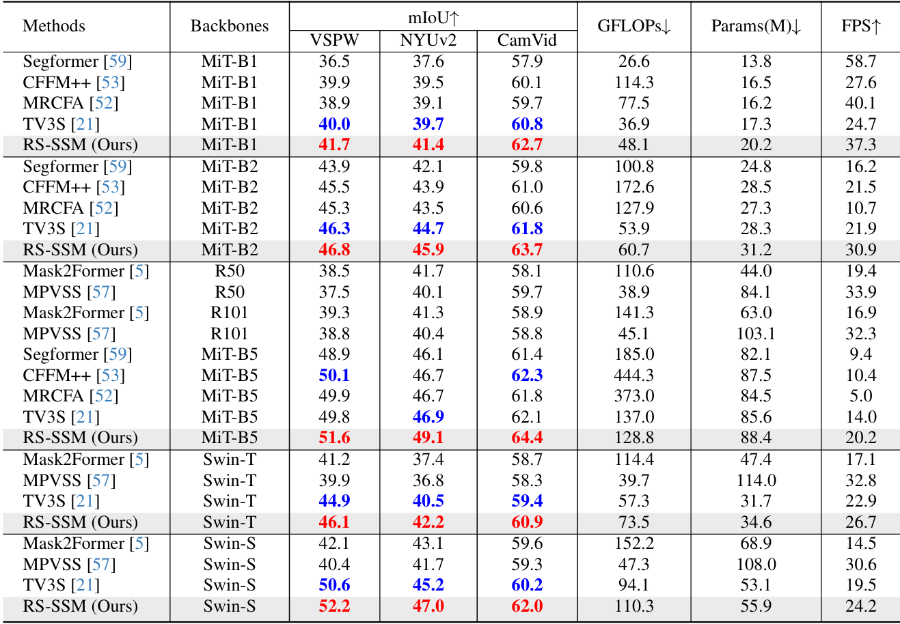

# [CVPR2026] RS-SSM: Refining Forgotten Specifics in State Space Model for Video Semantic Segmentation

<div align="center">

<p>
  <a href="https://cvpr.thecvf.com/Conferences/2026"></a>
  <a href='https://arxiv.org/abs/2603.24295'></a>
  
</p>

<p>
      <strong>Kai Zhu</strong><sup>1</sup>&emsp;
      <strong>Zhenyu Cui</strong><sup>2</sup>&emsp;
      <strong>Zehua Zang</strong><sup>3,4</sup>&emsp;
      <strong>Jiahuan Zhou</strong><sup>1 *</sup>
<p>

<p>
  <sup>1</sup>Wangxuan Institute of Computer Technology, Peking University&emsp;
  <sup>2</sup>Tsinghua University&emsp;
  <sup>3</sup>Institute of Software Chinese Academy of Sciences&emsp;
  <sup>4</sup>University of Chinese Academy of Sciences&emsp;
<p>

</div>

---

> The *official* repository for  [RS-SSM: Refining Forgotten Specifics in State Space Model for Video Semantic Segmentation](https://arxiv.org/abs/2603.24295).


### Environment

This code is based on Python 3.10.16, pytorch 2.2.0, pytorch-cuda 11.8, and torchvision 0.17.0.

```bash
conda create -n rs-ssm python=3.10.16
conda activate rs-ssm

pip install \
  torch==2.2.0 \
  torchvision==0.17.0 \
  torchaudio==2.2.0 \
  --index-url https://download.pytorch.org/whl/cu121
```

Please install the `mmcv` and `causal-conv1d` libraries as follows:

```bash
cd 3rdparty/mmcv/
export MMCV_WITH_OPS=1
export FORCE_MLU=1
python setup.py develop

cd ..
git clone https://github.com/Dao-AILab/causal-conv1d.git -b v1.5.0.post8
export MAX_JOBS=16
cd causal-conv1d/
python setup.py install
cd ..
```

Please set up `mmseg` following the [MMSegmentation v0.11.0 installation guide](https://github.com/open-mmlab/mmsegmentation/blob/v0.11.0/docs/get_started.md#installation), and compile `mamba` from source using the instructions provided in [Mamba v1.0.0](https://github.com/state-spaces/mamba/tree/v1.0.0).

For a complete configuration environment, see `requirements.txt`.

### Data and Model Preparation

- The VSPW dataset can be downloaded in [VSPW_baseline repo](https://github.com/VSPW-dataset/VSPW_baseline).

- The Cityscapes dataset can be downloaded at [Cityscapes](https://www.cityscapes-dataset.com/).

- The NYUv2 dataset can be downloaded at [NYUv2](https://cs.nyu.edu/~fergus/datasets/nyu_depth_v2.html).

- The CamVid dataset can be downloaded at [CamVid repo](https://github.com/lih627/CamVid).

The pre-trained backbone weights can be downloaded at [SegFormer repo](https://github.com/NVlabs/SegFormer) and [Swin-Transformer repo](https://github.com/microsoft/Swin-Transformer).

After downloading the datasets and pre-trained weights, please change the paths in `local_configs/_base_/datasets` and `local_configs/rs-ssm` accordingly.

### Quick Start

You can directly run the pre-written shell script:

```bash
# Create a dedicated temp directory
mkdir ~/tmp_dir
export TMPDIR=~/tmp_dir

chmod +x ./tools/train/VSPW/vspw_ss.sh
./tools/train/VSPW/vspw_ss.sh

chmod +x ./tools/test/VSPW/test_vspw_ss.sh
./tools/test/VSPW/test_vspw_ss.sh

rm -rf ~/tmp_dir/*
```

### Results

The following results were obtained with four NVIDIA 4090 GPUs:



### Citation

If you find our paper and code useful in your research, please consider giving a star and citation.

```bibtex
@inproceedings{zhu2026rs,
  title={RS-SSM: Refining Forgotten Specifics in State Space Model for Video Semantic Segmentation},
  author={Zhu, Kai and Cui, Zhenyu and Zang, Zehua and Zhou, Jiahuan},
  booktitle={Proceedings of the IEEE/CVF Conference on Computer Vision and Pattern Recognition},
  year={2026}
}
```

### Acknowledgement

Built on top of:

* [VSS-CFFM by Guolei Sun](https://github.com/GuoleiSun/VSS-CFFM)
* [MMSegmentation](https://github.com/open-mmlab/mmsegmentation)
* [VideoMamba](https://github.com/OpenGVLab/VideoMamba)
* [SegFormer by NVlabs](https://github.com/NVlabs/SegFormer)
* [Focal Transformer by Microsoft](https://github.com/microsoft/Focal-Transformer)
* [TV3S](https://github.com/Ashesham/TV3S)

Thanks for their excellent work and open-source code!

